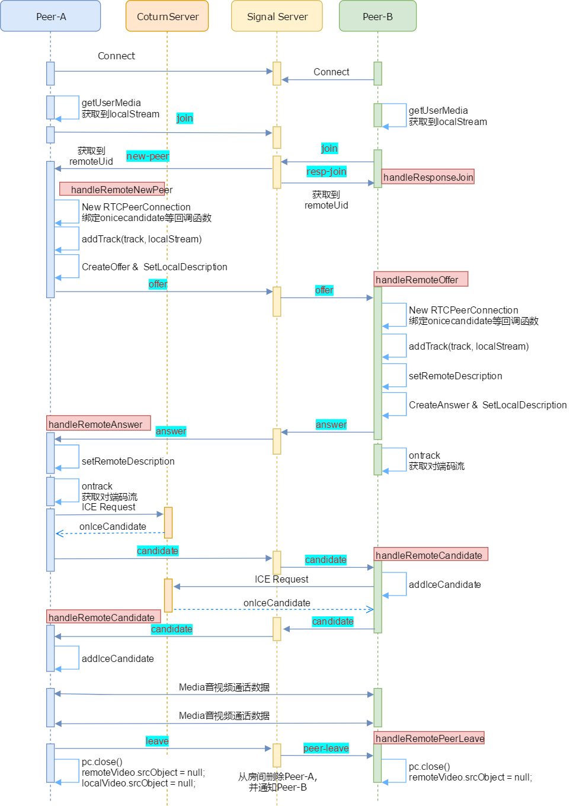

AnalysisAVP

Analysis of audio and video protocols

## 音视频录制原理


## 音视频播放原理


## YUV格式

- 主要用于视频信号的压缩、传输和存储，和向后相容老式黑白电视。
- 其中“Y”表示明亮度（Luminance或Luma），**也称灰阶值**。
- “U”和“V”表示的则是色度（Chrominance或Chroma）**作用是描述影像色彩及饱和度**，用于指定像素的颜色。
- 对于planar的YUV格式，先连续存储所有像素点的Y，紧接着存储所有像素点的U，随后是所有像素点的V。
- 对于packed的YUV格式，每个像素点的Y,U,V是连续存储的。
- **libyuv**，Google开源的实现各种YUV与RGB间相互转换、旋转、缩放的库。
- YUV 4:4:4采样，每一个Y对应一组UV分量。
- YUV 4:2:2采样，每两个Y共用一组UV分量。 
- YUV 4:2:0采样，每四个Y共用一组UV分量。

## 视频主要概念

- **视频码率**： **kb/s**，是指视频文件在单位时间内使用的数据流量，也叫码流率。码率越大，说明单位时间内取样率越大，数据流精度就越高。
- **视频帧率**：**fps**，通常说一个视频的25帧，指的就是这个视频帧率，即1秒中会显示25帧。帧率越高，给人的视觉就越流畅。
- **视频分辨率**：分辨率就是我们常说的640x480分辨率、1920x1080分辨率，分辨率影响视频图像的大小。
- **I** 帧（**Intra coded frames**）：

    - I帧不需要参考其他画面而生成,解码时仅靠自己就重构完整图像;

    - I帧图像采用帧内编码方式;

    - I帧所占数据的信息量比较大;

    - I帧图像是周期性出现在图像序列中的，出现频率可由编码器选择;

    - I帧是P帧和B帧的参考帧(其质量直接影响到同组中以后各帧的质量);

    - I帧是帧组GOP的基础帧(第一帧),在一组中只有一个I帧;

    - I帧不需要考虑运动矢量;
- **P** 帧（**Predicted frames**）：根据本帧与相邻的前一帧（I帧或P帧）的不同点来压缩本帧数据，同时利用了空间和时间上的相关性。
- P帧属于前向预测的帧间编码。它需要参考前面最靠近它的**I**帧或**P**帧来解码。
- **B** 帧（**Bi-directional predicted frames**）：B 帧图像采用双向时间预测，可以大大提高压缩倍数。

## 音频主要概念

- **采样频率**： 每秒钟采样的点的个数。常用的采样频率有：

    - 22000（22kHz）： 无线广播。

    - 44100（44.1kHz）： CD音质。

    - 48000（48kHz）： 数字电视，DVD。

    - 96000（96kHz）： 蓝光，高清DVD。

    - 192000(192kHz): 蓝光，高清DVD。

- **采样精度（采样深度）** ：每个“样本点”的大小，常用的大小为8bit， 16bit，24bit。

- **通道数**： 单声道，双声道，四声道，5.1声道。

- **比特率**： 每秒传输的bit数，单位为：bps（Bit Per Second）间接衡量声音质量的一个标准。没有压缩的音频数据的比特率 = 采样频率 * 采样精度 * 通道数。

- **码率**： 压缩后的音频数据的比特率。常见的码率：

    - 96kbps： FM质量

    - 128-160kbps：一般质量音频。

    - 192kbps： CD质量。

    - 256-320Kbps：高质量音频

    - 码率越大，压缩效率越低，音质越好，压缩后数据越大。

    - 码率 = 音频文件大小/时长。

- **帧**： 每次编码的采样单元数，比如MP3通常是1152个采样点作为一个编码单元，AAC通常是1024个采样点作为一个编码单元。

- **帧长** ：可以指每帧播放持续的时间：每帧持续时间(秒) = 每帧采样点数 / 采样频率（HZ）比如：MP3 48k, 1152个采样点,每帧则为 24毫秒,1152/48000= 0.024 秒 = 24毫秒；也可以指压缩后每帧的数据长度。

- **交错模式**： 数字音频信号存储的方式。数据以连续帧的方式存放，即首先记录帧1的左声道样本和右声道样本，再开始帧2的记录...

- **非交错模式**： 首先记录的是一个周期内所有帧的左声道样本，再记录所有右声道样本。

- 数字音频压缩编码在保证信号在听觉方面不产生失真的前提下，对音频数据信号进行尽可能大的压缩，降低数据量。数字音频压缩编码采取去除声音信号中冗余成分的方法来实现。所谓冗余成分指的是音频中不能被人耳感知到的信号，它们对确定声音的音色，音调等信息没有任何的帮助。

## 封装概念

- **封装格式** (也叫容器）就是将已经编码压缩好的视频流、音频流及字幕按照一定的方案放到一个文件中，便于播放软件播放。

- **一般来说，视频文件的后缀名就是它的封装格式。**

- **封装的格式不一样，后缀名也就不一样。**

## 音视频同步

- **DTS**（**Decoding Time Stamp**）：即解码时间戳，这个时间戳的意义在于告诉播放器该在什么时候解码这一帧的数据。

- **PTS**（**Presentation Time Stamp**）：即显示时间戳，这个时间戳用来告诉播放器该在什么时候显示这一帧的数据。

- **音视频同步方式：**

    Audio Master：同步视频到音频

    Video Master：同步音频到视频

    External Clock Master：同步音频和视频到外部时钟

    一般情况下 Audio Master > External Clock Master > Video Master 

## H264（新一代视频压缩编码标准）

- H264采⽤了16*16的分块⼤⼩对，视频帧图像进⾏相似⽐较和压缩编码

- H264使⽤帧内压缩和帧间压缩的⽅式提⾼编码压缩率

- H264采⽤了独特的I帧、P帧和B帧策略来实现，连续帧之间的压缩

    

- H264将视频分为连续的帧进⾏传输，在连续的帧之间使⽤I帧、P帧和B帧。同时对于帧内⽽⾔，将图像分块为⽚、宏块和字块进⾏分⽚传输；通过这个过程实现对视频⽂件的压缩包装。

- ⼀个序列的第⼀个图像叫做 IDR 图像（⽴即刷新图像），IDR 图像都是 I 帧图像。I和IDR帧都使⽤帧内预测。I帧不⽤参考任何帧，但是之后的P帧和B帧是有可能参考这个I帧之前的帧的。IDR就不允许这样。其核⼼作⽤是，是为了解码的重同步，当解码器解码到 IDR 图像时，⽴即将参考帧队列清空，将已解码的数据全部输出或抛弃，重新查找参数集，开始⼀个新的序列。这样，如果前⼀个序列出现重⼤错误，在这⾥可以获得重新同步的机会。IDR图像之后的图像永远不会使⽤IDR之前的图像的数据来解码。

    

- SPS：序列参数集，SPS中保存了⼀组编码视频序列(Coded video sequence)的全局参数。
- PPS：图像参数集，对应的是⼀个序列中某⼀幅图像或者某⼏幅图像的参数。
- I帧：帧内编码帧，可独⽴解码⽣成完整的图⽚。
- P帧: 前向预测编码帧，需要参考其前⾯的⼀个I帧或者B帧来⽣成⼀张完整的图⽚。
- B帧: 双向预测内插编码帧，则要参考其前⼀个I或者P帧及其后⾯的⼀个P帧来⽣成⼀张完整的图⽚。  
- 发I帧之前，⾄少要发⼀次SPS和PPS。 

    

- NAL层，视频数据网络抽象层（Network Abstraction Layer）
- VCL层，视频数据编码层（Video Coding Layer）

    

- SODB，数据位串（String Of Data Bits）。原始数据比特流，长度不一定是8的倍数，故需要补齐。由VCL层产生。

- RBSP，原始字节序列负载（Raw Byte Sequence Playload）。SODB + trailing bits，算法是如果SODB最后一个字节不对齐，则补1和多个0。

    

    

- NALU，NAL单元。NAL Header（1B）+ RBSP。
- H.264标准指出，当数据流是储存在介质上时，在每个NALU前添加起始码：0x000001或0x00000001，⽤来指示⼀个NALU的起始和终⽌位置 。
- 3字节的0x000001只有⼀种场合下使⽤，就是⼀个完整的帧被编为多个slice（⽚）的时候，包含这些slice的NALU使⽤3字节起始码。其余场合都是4字节0x00000001的。  
- H264有两种封装
    - ⼀种是annexb模式，传统模式，有startcode，SPS和PPS是在ES中。
    - ⼀种是mp4模式，⼀般mp4 mkv都是mp4模式，没有startcode，SPS和PPS以及其它信息被封装在container中，每⼀个frame前⾯4个字节是这个frame的⻓度。很多解码器只⽀持annexb这种模式，因此需要将mp4做转换：在ffmpeg中⽤h264_mp4toannexb_filter可以做转换。
- 需要说明的是，通过提⾼GOP值来提⾼图像质量是有限度的，在遇到场景切换的情况时，H.264编码器会⾃动强制插⼊⼀个I帧，此时实际的GOP值被缩短了。另⼀⽅⾯，在⼀个GOP中，P、B帧是由I帧预测得到的，当I帧的图像质量⽐较差时，会影响到⼀个GOP中后续P、B帧的图像质量，直到下⼀个GOP开始才有可能得以恢复，所以GOP值也不宜设置过⼤。  
- 由于P、B帧的复杂度⼤于I帧，所以过多的P、B帧会影响编码效率，使编码效率降低。另外，过⻓的GOP还会影响Seek操作的响应速度，由于P、B帧是由前⾯的I或P帧预测得到的，所以Seek操作需要直接定位，解码某⼀个P或B帧时，需要先解码得到本GOP内的I帧及之前的N个预测帧才可以，GOP值越⻓，需要解码的预测帧就越多，seek响应的时间也越⻓。  
- P帧特点:
    1) P帧是I帧后⾯相隔1~2帧的编码帧;
    2) P帧采⽤运动补偿的⽅法传送它与前⾯的I或P帧的差值及运动⽮量(预测误差);
    3) 解码时必须将I帧中的预测值与预测误差求和后才能重构完整的P帧图像;
    4) P帧属于前向预测的帧间编码。它只参考前⾯最靠近它的I帧或P帧;
    5) P帧可以是其后⾯P帧的参考帧,也可以是其前后的B帧的参考帧;
    6) 由于P帧是参考帧,它可能造成解码错误的扩散;
    7) 由于是差值传送,P帧的压缩⽐较⾼。  
- B帧特点
    1）B帧是由前⾯的I或P帧和后⾯的P帧来进⾏预测的;
    2）B帧传送的是它与前⾯的I或P帧和后⾯的P帧之间的预测误差及运动⽮量;
    3）B帧是双向预测编码帧;
    4）B帧压缩⽐最⾼,因为它只反映两参考帧间运动主体的变化情况,预测⽐较准确;
    5）B帧不是参考帧,不会造成解码错误的扩散。  

## AAC（高级音频编码）

- ADIF，音频数据交换格式（Audio Data Interchange Format）。这种格式的特征是可以确定的找到这个音频数据的开始，不需进行在音频数据流中间开始的解码，即它的解码必须在明确定义的开始处进行。故这种格式常用在磁盘文件中。

    

    

    

- ADTS，音频数据传输流（Audio Data Transport Stream）。这种格式的特征是它是一个有同步字的比特流，解码可以在这个流中任何位置开始。它的特征类似于mp3数据流格式。

    

    

    - 每⼀帧的ADTS的头⽂件都包含了⾳频的采样率，声道，帧⻓度等信息，这样解码器才能解析读取。⼀般情况下ADTS的头信息都是7个字节，分为2部分：

        - adts_fixed_header();

        - adts_variable_header();

        - 其⼀为固定头信息，紧接着是可变头信息。固定头信息中的数据每⼀帧都相同，⽽可变头信息则在帧与帧之间可变。

    - syncword ：同步头 总是0xFFF, all bits must be 1，代表着⼀个ADTS帧的开始 
    
    - ID：MPEG标识符，0标识MPEG-4，1标识MPEG-2
    
    - Layer：always: '00'
    
    - protection_absent：表示是否误码校验。Warning, set to 1 if there is no CRC and 0 if there is CRC
    
    - profile：表示使⽤哪个级别的AAC，如01 Low Complexity(LC)--- AAC LC。有些芯⽚只⽀持AAC LC。profile的值等于 Audio Object Type的值减1。profile = MPEG-4 Audio Object Type - 1  
    
        
    
    - sampling_frequency_index：表示使⽤的采样率下标，通过这个下标在Sampling Frequencies[ ]数组中查找得知采样率的值。  
    
        
    
    - channel_configuration: 表示声道数，⽐如2表示⽴体声双声道
    
        
    
    - frame_length : ⼀个ADTS帧的⻓度包括ADTS头和AAC原始流
        - frame length, this value must include 7 or 9 bytes of header length:
        - aac_frame_length = (protection_absent == 1 ? 7 : 9) + size(AACFrame)
        - protection_absent=0时, header length=9bytes
        - protection_absent=1时, header length=7bytes
    - adts_buffer_fullness：0x7FF 说明是码率可变的码流。
    - number_of_raw_data_blocks_in_frame：表示ADTS帧中有number_of_raw_data_blocks_in_frame + 1个AAC原始帧。所以说number_of_raw_data_blocks_in_frame == 0 表示说ADTS帧中有⼀个AAC数据块。

- ADTS可以在任意帧解码，也就是说它每⼀帧都有头信息。ADIF只有⼀个统⼀的头，所以必须得到所有的数据后解码。

## FLV


- FLV(Flash Video)是Adobe公司推出的⼀种流媒体格式，由于其封装后的⾳视频⽂件体积⼩、封装简单等特点，⾮常适合于互联⽹上使⽤。⽬前主流的视频⽹站基本都⽀持FLV。  

- FLV封装格式是由⼀个⽂件头(file header)和 ⽂件体(file Body)组成。其中，FLV body由⼀对对的(Previous Tag Size字段 + tag)组成。Previous Tag Size字段 排列在Tag之前，占⽤4个字节。Previous Tag Size记录了前⾯⼀个Tag的⼤⼩，⽤于逆向读取处理。FLV header后的第⼀个Pervious Tag Size的值为0。

- FLV header 由如下字段组成，其中前三个字节内容固定是*FLV*，最后4个字节内容固定是9（对*FLV*版本1来说）

    | 字段 | 字段类型 | 字段含义 |
    | :- | :--: | :- |
    | Signature | UI8 |签名，固定为'F' (0x46)|
    | Signature | UI8 |签名，固定为'L' (0x4c)|
    | Signature | UI8 |签名，固定为'V' (0x56)|
    | Version | UI8 |版本，比如 0x01 表示 FLV 版本 1|
    | TypeFlagsReserved | UB[5] |全为0|
    | TypeFlagsAudio | UB[1] |1表示有audio tag，0表示没有|
    | TypeFlagsReserved | UB[1] |全为0|
    | TypeFlagsVideo | UB[1] |1表示有video tag，0表示没有|
    | DataOffset | UI32 |FLV header的大小，单位是字节|

- FLV file body 很有规律，由一系列的*TagSize*和*Tag* 组成，其中*PreviousTagSize0*总是为0；*tag*由*tag header*、*tag body*组成；对*FLV*版本1，*tag header*固定为11个字节，因此，*PreviousTagSize*（除第1个）的值为 11 + 前一个*tag*的*tag body*的大小；

    | 字段 | 字段类型 | 字段含义 |
    | :- | :-: | :- |
    | PreviousTagSize0 | UI32 |总是0|
    | Tag1 | FLVTAG |第1个tag|
    | PreviousTagSize1 | UI32 |前一个tag的大小，包括tag header|
    | Tag2 | FLVTAG |第2个tag|
    | ... | ... |...|
    | PreviousTagSizeN-1 | UI32 |第N-1个tag的大小|
    | TagN | FLVTAG |第N个tag|
    | PreviousTagSizeN | UI32 |第N个tag的大小，包含tag header|

- FLV tag 由*tag header*+*tag body*组成。
    *tag header*如下，总共占据11个字节：

    | 字段 | 字段类型 |字段含义|
    | :- | :-: | :- |
    | TagType | UI8 |tag类型：<br>8：audio<br>9：video<br>18：script data<br>其他：保留 |
    | DataSize | UI24 |tag body的大小|
    | Timestamp | UI24 |相对于第一个tag的时间戳（单位是毫秒）第一个tag的Timestamp为0|
    | TimestampExtended | UI8 |时间戳的扩展字段，当 Timestamp 3个字节不够时，会启用这个字段，代表高8位|
    | StreamID | UI24 |总是0|
    | Data | 取决于根据TagType |TagType=8，则为AUDIODATA<br>TagType=9，则为VIDEODATA<br>TagType=18，则为SCRIPTDATAOBJECT|

- Tag⼀般可以分为3种类型：脚本(帧)数据类型、⾳频数据类型、视频数据。FLV数据以⼤端序进⾏存储，在解析时需要注意。

    

- ⼀个FLV⽂件，每种类型的tag都属于⼀个流，也就是⼀个flv⽂件最多只有⼀个⾳频流，⼀个视频流，不存在多个独⽴的⾳视频流在⼀个⽂件的情况。

- flv⽂件中Timestamp和TimestampExtended拼出来的是dts。也就是解码时间。Timestamp和TimestampExtended拼出来dts单位为ms。(如果不存在B帧，当然dts等于pts)。

- Script data脚本数据就是描述视频或⾳频的信息的数据，如宽度、⾼度、时间等等，⼀个⽂件中通常只有⼀个元数据，⾳频tag和视频tag就是⾳视频信息了，采样、声道、频率，编码等信息。 

- **Script Tag Data结构(脚本类型、帧类型)**

    
    
    - 该类型Tag⼜被称为MetaData Tag,存放⼀些关于FLV视频和⾳频的元信息，⽐如：duration、width、height等。通常该类型Tag会作为FLV⽂件的第⼀个tag，并且只有⼀个，跟在File Header后。
    
    - AMF包中第一个字节为类型标识：
    
        - Number 0×00;
    
        - Boolean 0×01;
    
        - String 0×02;
    
        - Object 0×03;
    
        - MovieClip 0×04;
    
        - Null 0×05;
    
        - Undefined 0×06;
    
        - Reference 0×07;
    
        - ECMAArray 0×08;
    
        - ObjectEnd 0×09;
    
        - StrictArray 0x0a;
    
        - Date 0x0b;
    
        - LongString 0x0c;
    
        - Unsupported 0x0d;
    
        - Recordset 0x0e;
    
        - XMLObject 0x0f;
    
        - TypedObject(Class) 0×10;
    
* **Audio Tag Data结构(⾳频类型)**

    - *Audio tags*定义如下所示：

        | 字段 | 字段类型 |字段含义|
        | :- | :-: | :- |
        | SoundFormat | UB[4] |音频格式，重点关注 10 = AAC<br>0 = Linear PCM, platform endian<br>1 = ADPCM<br>2 = MP3<br>3 = Linear PCM, little endian<br>4 = Nellymoser 16-kHz mono<br>5 = Nellymoser 8-kHz mono<br>6 = Nellymoser<br>7 = G.711 A-law logarithmic PCM<br>8 = G.711 mu-law logarithmic PCM<br>9 = reserved<br>10 = AAC<br>11 = Speex<br>14 = MP3 8-Khz<br>15 = Device-specific sound|
        | SoundRate | UB[2] |采样率，对AAC来说，永远等于3<br>0 = 5.5-kHz<br>1 = 11-kHz<br>2 = 22-kHz<br>3 = 44-kHz|
        | SoundSize | UB[1] |采样精度，对于压缩过的音频，永远是16位<br>0 = snd8Bit<br>1 = snd16Bit|
        | SoundType | UB[1] |声道类型，对Nellymoser来说，永远是单声道；对AAC来说，永远是双声道；<br>0 = sndMono 单声道<br>1 = sndStereo 双声道|
        | SoundData | UI8[size of sound data] |如果是AAC，则为 AACAUDIODATA；其他请参考规范；|
    
        - *AACAUDIODATA*

            当*SoundFormat*为10时，表示音频采AAC进行编码，此时，*SoundData*的定义如下：
    
            | 字段 | 字段类型 | 字段含义|
            | :- | :-: | :- |
            | AACPacketType | UI8 |0: AAC sequence header<br>1: AAC raw|
            | Data | UI8[n] |如果AACPacketType为0，则为AudioSpecificConfig；如果AACPacketType为1，则为AAC帧数据|
    
        - *AudioSpecificConfig*
    
            | 字段 | 字段类型 | 字段含义 |
            | :- | :-: | :- |
            | AudioObjectType | UB[5] |编码器类型，比如2表示AAC-LC|
            | SamplingFrequencyIndex | UB[4] | 采样率索引值，比如4表示44100|
            | ChannelConfiguration | UB[4] | 声道配置，比如2代表双声道，front-left, front-right |
            | AOT Specific Config | UB[n] ||
    
    - ⾳频Tag Data区域开始的第⼀个字节包含了⾳频数据的参数信息，第⼆个字节开始为⾳频流数据。（这两个字节属于tag的data部分，不是header部分）。
    
    - 第⼆个字节开始为⾳频数据（需要判断该数据是真正的⾳频数据，还是⾳频config信息）。
    
        
    
- **Video Tag Data结构(视频类型)** 

    - *Video tags*定义如下：

        | 字段 | 字段类型 | 字段含义 |
        | :- | :-: | :- |
        | FrameType | UB[4] |重点关注1、2：<br>1: keyframe (for AVC, a seekable frame) —— 即H.264的IDR帧；<br>2: inter frame (for AVC, a non- seekable frame) —— H.264的普通I帧；<br>3: disposable inter frame (H.263 only)<br>4: generated keyframe (reserved for server use only)<br>5: video info/command frame|
        | CodecID | UB[4] |编解码器，主要关注 7（AVC）<br>1: JPEG (currently unused)<br>2: Sorenson H.263<br>3: Screen video<br>4: On2 VP6<br>5: On2 VP6 with alpha channel<br>6: Screen video version 2<br>7: AVC|
        | VideoData | 取决于CodecID |实际的媒体类型，主要关注 7:AVCVIDEOPACKE<br>2: H263VIDEOPACKET<br>3: SCREENVIDEOPACKET<br>4: VP6FLVVIDEOPACKET<br>5: VP6FLVALPHAVIDEOPACKET<br>6: SCREENV2VIDEOPACKET<br>7: AVCVIDEOPACKE|

        - *AVCVIDEOPACKE*当*CodecID*为7时，*VideoData*为 *AVCVIDEOPACKE*，也即*H.264*媒体数据。
        *AVCVIDEOPACKE*的定义如下：

        | 字段 | 字段类型 | 字段含义 |
        | :- | :-: | :- |
        | AVCPacketType | UI8 | 0: AVC sequence header<br>1: AVC NALU<br>2: AVC end of sequence |
        | CompositionTime | SI24 | 如果AVCPacketType=1，则为时间cts偏移量；否则，为0。当B帧的存在时，视频解码呈现过程中，dts、pts可能不同，cts的计算公式为 pts - dts/90，单位为毫秒；如果B帧不存在，则cts固定为0。 |
        | Data | UI8[n] | 1、如果如果AVCPacketType=0，则为AVCDecoderConfigurationRecord，H.264 视频解码所需要的参数集（SPS、PPS）<br>2、如果AVCPacketType=1，则为NALU（一个或多个）<br>3、如果AVCPacketType=2，则为空 |

    - 视频Tag Data开始的第⼀个字节包含视频数据的参数信息，第⼆个字节开始为视频流数据。
    - CompositionTime 表示PTS相对于DTS的偏移值， 在每个视频tag的第14-16字节。显示时间(pts) = 解码时间（tag的第5-8字节） + CompositionTime，CompositionTime的单位也是ms。

## FFmpeg

- 编译

    - Ubuntu

        ```shell
        # 安装环境依赖
        sudo apt-get update 
        sudo apt-get -y install autoconf automake build-essential cmake git-core libass-dev libfreetype6-dev libsdl2-dev libtool libva-dev libvdpau-dev libvorbis-dev libxcb1-dev libxcb-shm0-dev libxcb-xfixes0-dev pkg-config texinfo wget zlib1g-dev
        # 安装依赖库
        sudo apt-get -y install nasm
        sudo apt-get -y install yasm
        sudo apt-get -y install libx264-dev
        sudo apt-get -y install libx265-dev libnuma-dev
        sudo apt-get -y install libvpx-dev
        sudo apt-get -y install libfdk-aac-dev
        sudo apt-get -y install libmp3lame-dev
        sudo apt-get -y install libopus-dev
        # 下载ffmpeg源码
        wget https://ffmpeg.org/releases/ffmpeg-snapshot.tar.bz2
        # 编译
        tar xjvf ffmpeg-snapshot.tar.bz2
        cd ffmpeg
        ./configure --prefix="$PWD/ffmpeg_build" --pkg-config-flags="--static" --extra-cflags="-I$PWD/ffmpeg_build/include" --extra-ldflags="-L$PWD/ffmpeg_build/lib" --extra-libs="-lpthread -lm" --bindir="$PWD/ffmpeg_build/bin" --enable-gpl --enable-libass --enable-libfdk-aac --enable-libfreetype --enable-libmp3lame --enable-libopus --enable-libvorbis --enable-libvpx --enable-libx264 --enable-libx265 --enable-nonfree
        make -j 8
        make install
        ```

- 数据结构

    - AVFormatContext

        - iformat：输入媒体的AVInputFormat，比如指向AVInputFormat ff_flv_demuxer
        - nb_streams：输入媒体的AVStream 个数
        - streams：输入媒体的AVStream []数组
        - duration：输入媒体的时长（以微秒为单位），计算方式可以参考av_dump_format()函数。
        - bit_rate：输入媒体的码率

    - AVInputFormat

        - name：封装格式名称
        - extensions：封装格式的扩展名
        - id：封装格式ID
        - 一些封装格式处理的接口函数,比如read_packet()

    - AVStream

        - index：标识该视频/音频流
        - time_base：该流的时基， PTS*time_base=真正的时间（秒）
        - avg_frame_rate： 该流的帧率
        - duration：该视频/音频流长度
        - codecpar：编解码器参数属性

    - AVCodecParameters

        - codec_type：媒体类型，比如AVMEDIA_TYPE_VIDEO AVMEDIA_TYPE_AUDIO等
        - codec_id：编解码器类型， 比如AV_CODEC_ID_H264 AV_CODEC_ID_AAC等

    - AVCodecContext

        - codec：编解码器的AVCodec，比如指向AVCodec ff_aac_latm_decoder
        - width, height：图像的宽高（只针对视频）
        - pix_fmt：像素格式（只针对视频）
        - sample_rate：采样率（只针对音频）
        - channels：声道数（只针对音频）
        - sample_fmt：采样格式（只针对音频）

    - AVCodec

        - name：编解码器名称
        - type：编解码器类型
        - id：编解码器ID
        - 一些编解码的接口函数，比如int (*decode)() 

    - AVCodecParser
        - ⽤于解析输⼊的数据流并把它分成⼀帧⼀帧的压缩编码数据。⽐较形象
的说法就是把⻓⻓的⼀段连续的数据“切割”成⼀段段的数据

    - AVPacket

        

        - pts：显示时间戳
        - dts：解码时间戳
        - data：压缩编码数据
        - size：压缩编码数据大小
        - pos:数据的偏移地址
        - stream_index：所属的AVStream

    - AVFrame
      
        
        
        - data：解码后的图像像素数据（音频采样数据）
        - linesize：对视频来说是图像中一行像素的大小；对音频来说是整个音频帧的大小
        - width, height：图像的宽高（只针对视频）
        - key_frame：是否为关键帧（只针对视频） 。
        - pict_type：帧类型（只针对视频） 。例如I， P， B
        - sample_rate：音频采样率（只针对音频）
        - nb_samples：音频每通道采样数（只针对音频）
        - pts：显示时间戳  

- 初始化

    - ~~av_register_all()~~： 注册所有组件,4.0已经弃用
    - avdevice_register_all()对设备进行注册，比如V4L2等
    - avformat_network_init();初始化网络库以及网络加密协议相关的库（比如openssl）

- 封装

    - avformat_alloc_context();负责申请一个AVFormatContext结构的内存,并进行简单初始化
    - avformat_free_context();释放该结构里的所有东西以及该结构本身
    - avformat_close_input();关闭解复用器。关闭后就不再需要使用avformat_free_context 进行释放。
    - avformat_open_input();打开输入视频文件
    - avformat_find_stream_info()： 获取音视频文件信息
    - av_read_frame(); 读取音视频包
    - avformat_seek_file(); 定位文件
    - av_seek_frame():定位文件

- 解码

    - avcodec_alloc_context3(): 分配解码器上下文
    - avcodec_find_decoder()： 根据ID查找解码器
    - avcodec_find_decoder_by_name():根据解码器名字
    - avcodec_open2()： 打开编解码器
    - avcodec_decode_video2()： 解码一帧视频数据
    - avcodec_decode_audio4()： 解码一帧音频数据
    - avcodec_send_packet(): 发送编码数据包，输⼊参数可以为NULL，或者AVPacket的data域设置为NULL或者size域设置为0，表示将刷新所有的包，意味着数据流已经结束了
    - avcodec_receive_frame(): 接收解码后数据
    - avcodec_free_context():释放解码器上下文，包含了avcodec_close()
    - avcodec_close():关闭解码器
    - av_parser_init：初始化AVCodecParserContext
    - av_parser_parse2：解析获得⼀个Packet
    - av_get_bytes_per_sample: 获取每个sample中的字节数
    - avcodec_flush_buffers: 重置codec
    
- 编码

    - avcodec_find_encoder：根据指定的AVCodecID查找注册的编码器
    - avcodec_find_encoder_by_name：根据指定的编码器名称查找注册的编码器 
    - avcodec_alloc_context3：为AVCodecContext分配内存
    - avcodec_open2：打开编码器
    - avcodec_send_frame：将AVFrame⾮压缩数据给编码器
    - avcodec_receive_packet：获取到编码后的AVPacket数据，收到的packet需要⾃⼰释放内存
    - av_frame_get_buffer: 为⾳频或视频帧分配新的buffer。在调⽤这个函数之前，必须在AVFame上设
        置好以下属性：
        - format(视频为像素格式，⾳频为样本格式)
        - nb_samples(样本个数，针对⾳频)
        - channel_layout(通道类型，针对⾳频)
        - width/height(宽⾼，针对视频）
    - av_frame_make_writable：确保AVFrame是可写的，使⽤av_frame_make_writable()的问题是，在最坏的情况下，它会在您使⽤encode再次更改整个输⼊frame之前复制它。如果frame不可写，
        av_frame_make_writable()将分配新的缓冲区，并复制这个输⼊input frame数据，避免和编码器需要缓存该帧时造成冲突
    - av_samples_fill_arrays 填充⾳频帧
    - av_image_fill_arrays: 存储⼀帧像素数据存储到AVFrame对应的data buffer
    - av_image_get_buffer_size: 函数的作⽤是通过指定像素格式、图像宽、图像⾼来计算所需的内存⼤⼩
        重点说明⼀个参数align:此参数是设定内存对⻬的对⻬数，也就是按多⼤的字节进⾏内存对⻬
    - av_image_alloc: 此函数的功能是按照指定的宽、⾼、像素格式来分配图像内存
    - av_image_fill_arrays(): 函数⾃身不具备内存申请的功能，此函数类似于格式化已经申请的内存，即通过
        av_malloc()函数申请的内存空间，或者av_frame_get_buffer()函数申请的内存空间
    
- 封装

    - avformat_write_header ： 写⽂件头
    - av_write_frame/av_interleaved_write_frame： 写packet
    - av_write_trailer ： 写⽂件尾  
    - avcodec_parameters_from_context：将AVCodecContext结构体中码流参数拷⻉到AVCodecParameters结构体中，和avcodec_parameters_to_context刚好相反
    - avformat_alloc_output_context2: 分配输出上下文
    - avformat_new_stream : 创建流
    - av_compare_ts : 比较时间戳
    - av_q2d(): 将时间从AVRational形式转换为double形式。AVRational是分数类型，double是双精度浮点数
        类型，转换的结果单位是秒。转换前后的值基于同⼀时间基，仅仅是数值的表现形式不同⽽已
    - av_rescale_q(): ⽤于不同时间基的转换，⽤于将时间值从⼀种时间基转换为另⼀种时间基。
        将a数值由 bq时间基转成 cq的时间基，通过返回结果获取以cq时间基表示的新数值  
    - av_packet_rescale_ts(): ⽤于将AVPacket中各种时间值从⼀种时间基转换为另⼀种时间基

## SDL2

- SDL将功能分成下列数个子系统（subsystem）：
    - SDL_INIT_TIMER：定时器
    -  SDL_INIT_AUDIO：音频
    -  SDL_INIT_VIDEO：视频
    -  SDL_INIT_JOYSTICK：摇杆
    -  SDL_INIT_HAPTIC：触摸屏
    -  SDL_INIT_GAMECONTROLLER：游戏控制器
    -  SDL_INIT_EVENTS：事件
    -  SDL_INIT_EVERYTHING：包含上述所有选项

- SDL视频显示

  - SDL_Init()：初始化SDL系统
  - SDL_CreateWindow()：创建窗口SDL_Window
  - SDL_CreateRenderer()：创建渲染器SDL_Renderer
  - SDL_CreateTexture()：创建纹理SDL_Texture
  - SDL_UpdateTexture()：设置纹理的数据
  - SDL_RenderCopy()：将纹理的数据拷贝给渲染器
  - SDL_RenderPresent()：显示
  - SDL_Delay()：工具函数，用于延时
  - SDL_Quit()：退出SDL系统

- SDL数据结构

    - SDL_Window 代表了一个“窗口”
    - SDL_Renderer 代表了一个“渲染器”
    - SDL_Texture 代表了一个“纹理”
    - SDL_Rect 一个简单的矩形结构

- SDL事件

    - SDL_WaitEvent()：等待一个事件
    - SDL_PushEvent()：发送一个事件
    - SDL_PumpEvents()：将硬件设备产生的事件放入事件队列，用于读取事件，在调用该函数之前，必须调用SDL_PumpEvents搜集键盘等事件
    - SDL_PeepEvents()：从事件队列提取一个事件
    - SDL_Event：代表一个事件

- SDL多线程

    - SDL线程创建： SDL_CreateThread
    - SDL线程等待： SDL_WaitThead
    - SDL互斥锁： SDL_CreateMutex/SDL_DestroyMutex
    - SDL锁定互斥： SDL_LockMutex/SDL_UnlockMutex
    - SDL条件变量(信号量)： SDL_CreateCond/SDL_DestoryCond
    - SDL条件变量(信号量)等待/通知： SDL_CondWait/SDL_CondSingal

- SDL播放音频PCM

    - 打开音频设备

        ```C++
        typedef struct SDL_AudioSpec {
        int freq; // 音频采样率
        SDL_AudioFormat format; // 音频数据格式
        Uint8 channels; // 声道数: 1 单声道, 2 立体声
        Uint8 silence; // 设置静音的值， 因为声音采样是有符号的， 所以0当然就是这个值
        Uint16 samples; // 音频缓冲区中的采样个数，要求必须是2的n次
        Uint16 padding; // 考虑到兼容性的一个参数
        Uint32 size; // 音频缓冲区的大小，以字节为单位
        SDL_AudioCallback callback; // 填充音频缓冲区的回调函数
        void *userdata; // 用户自定义的数据
        } SDL_AudioSpec;
        
        // desired：期望的参数。
        // obtained：实际音频设备的参数，一般情况下设置为NULL即可。
        int SDLCALL SDL_OpenAudio(SDL_AudioSpec* desired, SDL_AudioSpec* obtained);
        ```

    - SDL_AudioCallback

        ```C++
        // userdata： SDL_AudioSpec结构中的用户自定义数据，一般情况下可以不用。
        // stream：该指针指向需要填充的音频缓冲区。
        // len：音频缓冲区的大小（以字节为单位） 1024*2*2。
        void (SDLCALL * SDL_AudioCallback) (void *userdata, Uint8 *stream, int len);
        ```

    - 播放音频数据

        ```C++
        // 当pause_on设置为0的时候即可开始播放音频数据。设置为1的时候，将会播放静音的值。
        void SDLCALL SDL_PauseAudio(int pause_on);
        ```

## RTMP

-  RTMP简介

    - RTMP(Real Time Messaging Protocol)是一个应用层协议，主要用于在Flash player和服务器之间传输视频、音频、控制命令等内容。该协议的突出优点是: 低延时。RTMP基于TCP, 默认使用端口1935。

- RTMP播放基本流程

    

    - RTMP是基于TCP的应用层协议。通过TCP三次握手，可实现RTMP客户端与RTMP服务器的指定端口(默认端口为1935)建立一个可靠的网络连接。这里的网络连接才是真正的物理连接。完成了三次握手，客户端和服务器端就可以开始传送数据。经过三次握手，客户端与服务器端1935端口建立了TCP Connection。

    

    - RTMP握手主要分为: 简单握手和复杂握手。
    - RTMP连接时不同的Application Instance可根据功能等进行区分，比如直播可以用live来表示，点播回放可以用vod来表示。
    - RTMP创建流用于创建逻辑通道，该通道用于传输视频、音频、metadata。在服务器的响应报文中会返回 ，用于唯一的标示该Stream。
    - RTMP播放用来播放指定流。开始传输音视频数据。如果发送play命令后想要立即播放，需要清空play队列中的其它流，并将reset置为true。
    - RTMP删除指定Stream ID的流。服务器不用对这条命令发送响应报文。

- RTMP消息结构

    

    

    - 消息主要分为三类: 协议控制消息、数据消息、命令消息等。
    - 协议控制消息

        - Message Type ID = 1 2 3 5 6和Message Type ID = 4两大类，主要用于协议内的控制

    - 数据消息

        - Message Type ID = 8 9 18
        - 8: Audio 音频数据
        - 9: Video 视频数据
        - 18: Metadata 包括音视频编码、视频宽高等信息。

    - 命令消息 

        - Command Message (20, 17)
        - 此类型消息主要有NetConnection和NetStream两个类，两个类分别有多个函数，该消息的调用，可理解为远程函数调用。

    - Message StreamID是音视频流的唯一ID, 一路流如果既有音频包又有视频包，那么这路流音频包的StreamID和他视频包的StreamID相同。

    

    - RTMP流中视频和音频拥有单独的Chunk Stream ID。比如音频的cs id=20，视频的cs id=21。接收端接收到Chunk之后，根据cs id分别将音频和视频“拼成消息”。
    - RTMP协议最多⽀持65597个⽤户⾃定义chunk stream ID，范围为[3，65599] ，ID 0, 1, 2被协议规范直接使⽤，其中ID值为0, 1分表表示了Basic Header占⽤2个字节和3个字节：
        - ID值0：代表Basic Header占⽤2个字节，CSID在 [64，319] 之间；
        - ID值1：代表Basic Header占⽤3个字节，CSID在 [64，65599] 之间；
        - ID值2：代表该chunk是控制信息和⼀些命令信息。
    - 当Basic Header为1个字节时，CSID占6位，6位最多可以表示64个数，因此这种情况下CSID在 [0，63] 之间，其中⽤户可⾃定义的范围为 [3，63]。
    - 当Basic Header为2个字节时，CSID占只占8位，第⼀个字节除chunk type占⽤的bit都置为0，第⼆个字节⽤来表示CSID-64，8位可以表示 [0, 255] 共256个数，ID的计算⽅法为（第⼆个字节+64），范围为 [64，319]。
    - 当Basic Header为3个字节时，以在此字段⽤3字节版本编码。ID的计算⽅法为（第三字节*256+第⼆字节+64）（Basic Header是采⽤⼩端存储的⽅式），范围为 [64，65599]。

    

    - Message被切割成一个或多个Chunk，然后在网络上进行发送。当发送时， 一个chunk发送完毕后才可以发送下一个chunk。
    - 拆分的时候， 默认的Chunk Size是128字节。

    

    - RTMP Chunk Header的长度不是固定的， 分为:12 Bytes、 8 Bytes、 4 Bytes、 1 Byte 四种，由RTMP Chunk Header前2位决定。

    
    

    - 一般情况下， msg stream id是不会变的，所以针对视频或音频， 除了第一个RTMP Chunk Header是12Bytes的， 后续即可采用8Bytes的。
    - 如果消息的长度(message length)和类型(msg type id, 如视频为9或音频为8)又相同，即可将这两部分也省去， RTMP Chunk Header采用4Bytes类型的。
    - 如果当前Chunk与之前的Chunk相比, msg stream id相同， msg typeid相同， message length相同，而且都属于同一个消息(由同一个Message切割成)，这类Chunk的时间戳(timestamp)也是相同的，故后续的也可以省去， RTMP Chunk Header采用1 Byte类型的。
    - 当Chunk Size足够大时(一般不这么干)，此时所有的Message都只能相应切割成一个Chunk，该Chunk仅msg stream id相同。此时基本上除了第一个Chunk的Header是12Bytes外，其它所有Chunk的Header都是8Bytes。
    - 一般只有rtmp流刚开始的metadata、绝对时间戳的视频或音频是12Bytes。
    - 有些控制消息也是12 Bytes, 比如connect。

- RTMP传输流程

    

    - 不同类型的消息会被分配不同的优先级，当网络传输能力受限时，优先级用来控制消息在网络底层的排队顺序。比如当客户端网络不佳时，流媒体服务器可能会选择丢弃视频消息，以保证音频消息可及时送达客户端。

    

    - RTMP Chunk Stream层级允许在Message stream层次，将大消息切割成小消息，这样可以避免大的低优先级的消息(如视频消息)阻塞小的高优先级的消息(如音频消息或控制消息)。

    - RTMP中时间戳的单位为毫秒(ms)。时间戳为相对于某个时间点的相对值。时间戳的长度为32bit，不考虑回滚的话，最大可表示49天17小时2分钟47.296秒。Timestamp delta单位也是毫秒，为相对于前一个时间戳的一个无符号整数； 可能为24bit或32bit。RTMP Message的时间戳4个字节；大端存储。
    - 用wireshark转包分析发现， rtmp流的chunk视频流(或音频流)除第一个视频时间戳为绝对时间戳外，后续的时间戳均为timestamp delta，即当前时间戳与上一个时间戳的差值。
    - 通常情况下， Chunk的时间戳(包括绝对时间戳Timestamp delta)是3个字节。但时间戳值超过0xFFFFFF时，启用Extended Timestamp(4个字节)来表示时间戳。
    - timestamp delta的值超过16777215 (即16进制的0xFFFFFF)时，这时候这三个字节必须被置为: 0xFFFFFF,以此来标示Extended Timestamp(4字节)将会存在，由Extended Timestamp来表示时间戳。

## HLS

- HLS简介

    - 作为Apple提出的⼀种基于HTTP的协议，HLS（HTTP Live Streaming）⽤于解决实时⾳视频流的传输。尤其是在移动端，由于iOS/H5不⽀持flash，使得HLS成了移动端实时视频流传输的⾸选。HLS经常⽤在直播领域，⼀些国内的直播云通常⽤HLS拉流（将视频流从服务器拉到客户端）。 HLS值得诟病之处就是其延迟严重，延迟通常在10-30s之间。

        

- HLS协议

    

    - 相对于常⻅的流媒体直播协议，例如RTMP协议、RTSP协议、MMS协议等，HLS直播最⼤的不同在于，直播客户端获取到的，并不是⼀个完整的数据流。HLS协议在服务器端将直播数据流存储为连续的、很短时⻓的媒体⽂件（MPEG-TS格式），⽽客户端则不断的下载并播放这些⼩⽂件，因为服务器端总是会将最新的直播数据⽣成新的⼩⽂件，这样客户端只要不停的按顺序播放从服务器获取到的⽂件，就实现了直播。由此可⻅，基本上可以认为，HLS是以点播的技术⽅式来实现直播。由于数据通过HTTP协议传输，所以完全不⽤考虑防⽕墙或者代理的问题，⽽且分段⽂件的时⻓很短，客户端可以很快的选择和切换码率，以适应不同带宽条件下的播放。不过HLS的这种技术特点，决定了它的延迟⼀般总是会⾼于普通的流媒体直播协议。

    - HLS协议由三部分组成：HTTP、M3U8、TS。这三部分中，HTTP 是传输协议，M3U8 是索引⽂件，TS是⾳视频的媒体信息。
    - HLS的m3u8，是⼀个ts的列表，也就是告诉浏览器可以播放这些ts⽂件。有⼏个关键的参数，这些参数在 SRS 的配置⽂件中都有配置项：
        - #EXTM3U：每个M3U⽂件第⼀⾏必须是这个tag，起标示作⽤
        - #EXT-X-VERSION：该属性可以没有，⽬前主要是version 3，最新的是7
        - #EXT-X-MEDIA-SEQUENCE：每⼀个media URI在PlayList中只有唯⼀的序号，相邻之间序号+1,⼀个media URI并不是必须要包含的，如果没有，默认为0
        - #EXT-X-TARGETDURATION：所有切⽚的最⼤时⻓。有些 Apple 设备这个参数不正确会⽆法播放。SRS会⾃动计算出 ts⽂件的最⼤时⻓，然后更新m3u8时会⾃动更新这个值。⽤户不必⾃⼰配置
        - #EXTINF：ts切⽚的实际时⻓，SRS提供配置项 hls_fragment，但实际上的ts时⻓还受gop影响
        - ts⽂件的数⽬：SRS可配置hls_window（单位是秒，不是数量），指定 m3u8 中保存多少个切⽚，譬如，每个ts切⽚为10秒，窗⼝为60秒，那么m3u8中最多保存6个ts切⽚，SRS会⾃动清理旧的切⽚
        - livestream-0.ts：SRS会⾃动维护ts切⽚的⽂件名，在编码器重推之后，这个编号会继续增⻓，保证流的连续性。直到SRS重启，这个编号才重置为0

    - 每⼀个m3u8⽂件，分别对应若⼲个ts⽂件，这些ts⽂件才是真正存放视频的数据。m3u8⽂件只是存放了⼀些ts⽂件的配置信息和相关路径，当视频播放时，m3u8是动态改变的，video标签会解析这个⽂件，并找到对应的ts⽂件来播放，所以⼀般为了加快速度，m3u8放在web服务器上，ts⽂件放在cdn上。

- HLS协议优势

    - HLS相对于RTMP来讲使⽤了标准的HTTP协议来传输数据，可以避免在⼀些特殊的⽹络环境下被屏蔽。
    - HLS相⽐RTMP在服务器端做负载均衡要简单得多。因为HLS是基于⽆状态协议 HTTP实现的，客户端只需要按照顺序使⽤下载存储在服务器的普通ts⽂件进⾏播放就可以。⽽RTMP是⼀种有状态协议，很难对视频服务器进⾏平滑扩展，因为需要为每⼀个播放视频流的客户端维护状态。
    - HLS协议本身实现了码率⾃适应，在不同带宽情况下，设备可以⾃动切换到最适合⾃⼰码率的视频播放。

- HLS协议劣势

    - HLS协议在直播的视频延迟时间很难做到10s以下延时，⽽RTMP协议的延时可以降到1s左右。

- TS文件分层

    - ts⽂件为传输流⽂件，视频编码主要格式为 H264/MPEG4，⾳频为 AAC/MP3。ts⽂件分为三层：
        
        - ts层：Transport Stream，是在pes层的基础上加⼊数据流的识别和传输必须的信息
        - pes层： Packet Elemental Stream，是在⾳视频数据上加了时间戳等对数据帧的说明信息
        - es层：Elementary Stream，即⾳视频数据

    - ts包⼤⼩固定为188字节，ts层分为三个部分：ts header、adaptation field、payload。
    - ts header固定4个字节；adaptation field可能存在也可能不存在，主要作⽤是给不⾜188字节的数据做填充；payload是pes数据

    - ts header:
        | name | size | desc |
        | :-: | :-: | :-: |
        | sync_byte | 8b | 同步字节，固定为0x47 |
        | transport_error_indicator | 1b | 传输错误指示符，表明在ts头的adapt域后由⼀个⽆⽤字节，通常都为0，这个字节算在adapt域⻓度内 |
        | payload_unit_start_indicator | 1b | 负载单元起始标示符，⼀个完整的数据包开始时标记为1 |
        | transport_priority | 1b | 传输优先级，0为低优先级，1为⾼优先级，通常取0 |
        | pid | 13b | pid值 |
        | transport_scrambling_control | 2b | 传输加扰控制，00表示未加密 |
        | adaptation_field_control | 2b | 是否包含⾃适应区，‘00’保留；‘01’为⽆⾃适应域，仅含有效负载；‘10’为仅含⾃适应域，⽆有效负载；‘11’为同时带有⾃适应域和有效负载 |
        | continuity_counter | 4b | 递增计数器，从0-f，起始值不⼀定取0，但必须是连续的 |

    - ts层的内容是通过PID值来标识的，主要内容包括：PAT表、PMT表、⾳频流、视频流。解析ts流要先找到PAT表，只要找到PAT就可以找到PMT，然后就可以找到⾳视频流了。PAT表和PMT表需要定期插⼊ts流，因为⽤户随时可能加⼊ts流，这个间隔⽐较⼩，通常每隔⼏个视频帧就要加⼊PAT和PMT。PAT和PMT表是必须的，还可以加⼊其它表如SDT（业务描述表）等，不过hls流只要有PAT和PMT就可以播放了

    - PAT表：主要的作⽤就是指明了PMT表的PID值。
    - PMT表：主要的作⽤就是指明了⾳视频流的PID值。
    - ⾳频流/视频流：承载⾳视频内容。

    - adaptation field:
        | name | size | desc |
        | :-: | :-: | :-: |
        | adaptation_field_length | 1B | ⾃适应域⻓度，后⾯的字节数 |
        | flag | 1B | 取0x50表示包含PCR或0x40表示不包含PCR |
        | PCR | 5B | Program Clock Reference，节⽬时钟参考，⽤于恢复出与编码端⼀致的系统时序时钟STC（System Time Clock） |
        | stuffing_bytes | xB | 填充字节，取值0xff |

    - PAT:
        | name | size | desc |
        | :-: | :-: | :-: |
        | table_id | 8b | PAT表固定为0x00 |
        | section_syntax_indicator | 1b | 固定为14 |
        | zero | 1b | 固定为0 |
        | reserved | 2b | 固定为11 |
        | section_length | 12b | 后⾯数据的⻓度 |
        | transport_stream_id | 16b | 传输流ID，固定为0x0001 |
        | reserved | 2b | 固定为11 |
        | version_number | 5b | 版本号，固定为00000，如果PAT有变化则版本号加1 |
        | current_next_indicator | 1b| 固定为1，表示这个PAT表可以⽤，如果为0则要等待下⼀个PAT表 |
        | section_number | 8b | 固定为0x00 |
        | last_section_number | 8b | 固定为0x00 |
        | 开始循环 | | |
        | program_number | 16b | 节⽬号为0x0000时表示这是NIT，节⽬号为0x0001时,表示这是PMT |
        | reserved | 3b | 固定为111 |
        | PID | 13b | 节⽬号对应内容的PID值 |
        | 结束循环 | | |
        | CRC32 | 32b | 前⾯数据的CRC32校验码 |

    - PMT:
        | name | size | desc |
        | :-: | :-: | :-: |
        | table_id | 8b | PMT表取值随意，0x02 |
        | section_syntax_indicator | 1b | 固定为1 |
        | zero | 1b | 固定为0 |
        | reserved | 2b | 固定为11 |
        | section_length | 12b | 后⾯数据的⻓度 |
        | program_number | 16b | 频道号码，表示当前的PMT关联到的频道，取值0x0001 |
        | reserved | 2b | 固定为11 |
        | version_number | 5b | 版本号，固定为00000，如果PAT有变化则版本号加1 |
        | current_next_indicator | 1b | 固定为1 |
        | section_number | 8b | 固定为0x005 |
        | last_section_number | 8b | 固定为0x00 |
        | reserved | 3b | 固定为111 |
        | PCR_PID | 13b | PCR(节⽬参考时钟)所在TS分组的PID，指定为视频PID |
        | reserved | 4b | 固定为1111 |
        | program_info_length | 12b | 节⽬描述信息，指定为0x000表示没有 |
        | 开始循环 | | |
        | stream_type | 8b | 流类型，标志是Video还是Audio还是其他数据，h.264编码对应0x1b，aac编码对应0x0f，mp3编码对应0x03 |
        | reserved | 3b | 固定为111 |
        | elementary_PID | 13b | 与stream_type对应的PID |
        | reserved | 4b | 固定为1111 |
        | ES_info_length | 12b | 描述信息，指定为0x000表示没有 |
        | 结束循环 | | |
        | CRC32 | 32b | 前⾯数据的CRC32校验码 |

    - pes:
        | name | size | desc |
        | :-: | :-: | :-: |
        | pes start code | 3B | 开始码，固定为0x000001 |
        | stream id | 1B | ⾳频取值（0xc0-0xdf），通常为0xc0;视频取值（0xe0-0xef），通常为0xe0 |
        | pes packet length | 2B | 后⾯pes数据的⻓度，0表示⻓度不限制，只有视频数据⻓度会超过0xffff |
        | flag | 1B | 通常取值0x80，表示数据不加密、⽆优先级、备份的数据 |
        | flag | 1B | 取值0x80表示只含有pts，取值0xc0表示含有pts和dts |
        | pes data length | 1B | 后⾯数据的⻓度，取值5或10 |
        | pts | 5B | 33bit值 |
        | dts | 5B | 33bit值 |

## WebSocket

- WebSocket 是 HTML5 开始提供的一种在单个 TCP 连接上进行全双工通讯的协议。

- WebSocket 使得客户端和服务器之间的数据交换变得更加简单，允许服务端主动向客户端推送数据。在 WebSocket API 中，浏览器和服务器只需要完成一次握手，两者之间就直接可以创建持久性的连接，并进行双向数据传输。  

    

- 浏览器通过 JavaScript 向服务器发出建立 WebSocket 连接的请求，连接建立以后，客户端和服务器端就可以通过TCP 连接直接交换数据。

- 当你获取 Web Socket 连接后，你可以通过 send() 方法来向服务器发送数据，并通过onmessage 事件来接收服务器返回的数据。

- 为了建立一个 WebSocket 连接，客户端浏览器首先要向服务器发起一个 HTTP 请求，这个请求和通常的 HTTP 请求不同，包含了一些附加头信息，其中附加头信息"Upgrade: WebSocket"表明这是一个申请协议升级的 HTTP 请求，服务器端解析这些附加的头信息然后产生应答信息返回给客户端，客户端和服务器端的 WebSocket 连接就建立起来了，双方就可以通过这个连接通道自由的传递信息，并且这个连接会持续存在直到客户端或者服务器端的某一方主动的关闭连接。

- 服务器端使用websocket需要安装nodejs-­websocket

    ```shell
    cd 工程目录
    sudo npm init
    #创建package.json文件
    sudo npm install nodejs-websocket
    ```

## SRS

- SRS源码获取

    ```shell
    git clone https://gitee.com/winlinvip/srs.oschina.git srs
    cd srs/trunk
    git remote set-url origin https://github.com/ossrs/srs.git
    git pull
    ```

- SRS编译

    ```shell
    ./configure
    make
    ```

- 启动SRS服务

    ```shell
    ./objs/srs -c conf/rtmp.conf
    ./objs/srs -c conf/hls.conf
    ```

- 测试SRS服务
  
    - 推流

        ```shell
        ffmpeg -re -i gx.flv -vcodec copy -acodec copy -f flv -y rtmp://127.0.0.1/live/test
        ```

    - 拉流

        ```shell
        ffplay rtmp://127.0.0.1/live/test
        ffplay http://127.0.0.1/live/test.m3u8
        ```

## WebRTC

- WebRTC简介

    - WebRTC（Web Real­Time Communication）是 Google于2010以6829万美元从 Global IP Solutions 公司购买，并于2011年将其开源，旨在建立一个互联网浏览器间的实时通信的平台，让 WebRTC技术成为 H5标准之一。
    - WebRTC虽然冠以“web”之名，但并不受限于传统互联网应用或浏览器的终端运行环境。实际上无论终端运行环境是浏览器、桌面应用、移动设备（Android或iOS）还是IoT设备，只要IP连接可到达且符合WebRTC规范就可以互通。这一点释放了大量智能终端（或运行在智能终端上的app）的实时通信能力，打开了许多对于实时交互性要求较高的应用场景的想象空间，譬如在线教育、视频会议、视频社交、远程协助、远程操控等等都是其合适的应用领域。全球领先的技术研究和咨询公司Technavio最近发布了题为“全球网络实时通讯（WebRTC）市场，2017­2021”的报告。报告显示，2017­2021年期间，全球网络实时通信（WebRTC）市场将以34.37％的年均复合增长率增长，增长十分迅速。增长主要来自北美、欧洲及亚太地区。

- WebRTC框架

    

- WebRTC通话原理

    - 媒体协商

        - 有一个专门的协议，称为Session Description Protocol(SDP)，可用于描述上述这类信息，在WebRTC中，参与视频通讯的双方必须先交换SDP信息，这样双方才能知根知底，而交换SDP的过程，也称为"媒体协商"。

    - 网络协商

        
        - 彼此要了解对方的网络情况，这样才有可能找到一条相互通讯的链路
        (1)获取外网IP地址映射；
        (2)通过信令服务器（signal server）交换"网络信息"。
        - 理想的网络情况是每个浏览器的电脑都是私有公网IP，可以直接进行点对点连接。
        - 实际情况是：我们的电脑和电脑之前或大或小都是在某个局域网中，需要NAT（Network Address Translation，网络地址转换）。
        - 在解决WebRTC使用过程中的上述问题的时候，我们需要用到STUN和TURN。

    - STUN

        - STUN（Session Traversal Utilities for NAT，NAT会话穿越应用程序）是一种网络协议，它允许位于NAT（或多重NAT）后的客户端找出自己的公网地址，查出自己位于哪种类型的NAT之后以及NAT为某一个本地端口所绑定的Internet端端口。这些信息被用来在两个同时处于NAT路由器之后的主机之间创建UDP通信。该协议由RFC 5389定义。

    - TURN
      
        - TURN的全称为Traversal Using Relays around NAT，是STUN/RFC5389的一个拓展，主要添加了Relay功能。如果终端在NAT之后，那么在特定的情景下，有可能使得终端无法和其对等端（peer）进行直接的通信，这时就需要公网的服务器作为一个中继，对来往的数据进行转发。这个转发的协议就被定义为TURN。

    - 信令服务器

        

        - 在基于WebRTC API开发应用（APP）时，可以将彼此的APP连接到信令服务器（Signal Server，一般搭建在公网，或者两端都可以访问到的局域网），借助信令服务器，就可以实现上面提到的SDP媒体信息及Candidate网络信息交换。信令服务器不只是交互媒体信息sdp和网络信息candidate，不如房间管理和人员进出。

    - 一对一通话

        
        
        - 在一对一通话场景中，每个 Peer均创建有一个 PeerConnection 对象，由一方主动发 Offer SDP，另一方则应答AnswerSDP，最后双方交换 ICE Candidate 从而完成通话链路的建立。但是在中国的网络环境中，据一些统计数据显示，至少1半的网络是无法直接穿透打通，这种情况下只能借助TURN服务器中转。

- 安装node.js

    ```shell
    # 下载
    wget https://nodejs.org/dist/v15.0.0/node-v15.0.0-linux-x64.tar.xz
    # 解压
    tar -xvf node-v15.0.0-linux-x64.tar.xz
    # 进入目录
    cd node-v15.0.0-linux-x64
    # 执行软连接
    sudo ln ‐s /mnt/e/ubuntu/node-v15.0.0-linux-x64/bin/npm /usr/local/bin/
    sudo ln ‐s /mnt/e/ubuntu/node-v15.0.0-linux-x64/bin/node /usr/local/bin/
    ```

- 安装coturn穿透和转发服务器

    ```shell
    # 安装依赖
    sudo apt‐get install libssl‐dev
    sudo apt‐get install libevent‐dev
    # 下载源码
    git clone https://github.com/coturn/coturn
    cd coturn
    # 编译安装
    ./configure prefix=/mnt/e/ubuntu/coturn/bin/
    make -j 8
    sudo make install
    # 启动
    turnserver --min-port 40000 --max-port 60000 -L 0.0.0.0 -a -u gongluck:123456 -v -f -r nort.gov
    # 浏览器测试
    https://webrtc.github.io/samples/src/content/peerconnection/trickle-ice/
    ```

- 安装nginx

    ```shell
    # 安装依赖
    sudo apt-get update
    sudo apt-get install build-essential libtool -y
    sudo apt-get install libpcre3 libpcre3-dev -y
    sudo apt-get install zlib1g-dev -y
    sudo apt-get install openssl -y
    #下载nginx
    wget http://nginx.org/download/nginx-1.19.0.tar.gz
    tar zxvf nginx-1.19.0.tar.gz
    cd nginx-1.19.0/
    # 配置，支持https
    ./configure --with-http_ssl_module
    # 编译
    make -j 8
    # 安装
    sudo make install
    # 启动
    sudo /usr/local/nginx/sbin/nginx
    # 停止
    sudo /usr/local/nginx/sbin/nginx -s stop
    # 重新加载配置文件
    sudo /usr/local/nginx/sbin/nginx -s reload
    ```
    
- 生成证书

    ```shell
    mkdir -p /root/cert
    cd /root/cert
    # CA私钥
    openssl genrsa -out key.pem 2048
    # 自签名证书
    openssl req -new -x509 -key key.pem -out cert.pem -days 1095
    ```

- 配置Web服务

    - 创建webrtc-­https.conf文件：

        ```shell
        server{
        	listen 443 ssl;
        	ssl_certificate /root/cert/cert.pem;
        	ssl_certificate_key /root/cert/key.pem;
        	charset utf‐8;
        	# ip地址或者域名
        	server_name www.gongluck.icu;
        	location / {
        		add_header 'Access-Control-Allow-Origin' '*';
        		add_header 'Access-Control-Allow-Credentials' 'true';
        		add_header 'Access-Control-Allow-Methods' '*';
        		add_header 'Access-Control-Allow-Headers' 'Origin, X-Requested-With, Content-Type,Accept';
        	# web页面所在目录
        	root /code/AnalysisAVP/example/WebRTC/demo/client/;
        	index index.php index.html index.htm;
        	}
        }
        ```

    - 创建webrtc-websocket-proxy.conf文件：

        ```shell
        map $http_upgrade $connection_upgrade {
        	default upgrade;
    	'' close;
        	}
    	upstream websocket {
        		server www.gongluck.icu:8099;
        	}
        	server {
        		listen 8098 ssl;
        		#ssl on;
        		ssl_certificate /root/cert/cert.pem;
        		ssl_certificate_key /root/cert/key.pem;
        		server_name www.gongluck.icu;
        	location /ws {
        		proxy_pass http://websocket;
        		proxy_http_version 1.1;
        		proxy_set_header Upgrade $http_upgrade;
        		proxy_set_header Connection $connection_upgrade;
        	}
        }
        ```
    
    - 编辑nginx.conf文件，在末尾}之前添加包含文件：
    
        ```shell
        include /code/AnalysisAVP/example/WebRTC/demo/client/webrtc-https.conf;
        include /code/AnalysisAVP/example/WebRTC/demo/client/webrtc-websocket-proxy.conf;
        ```
    
        
    

